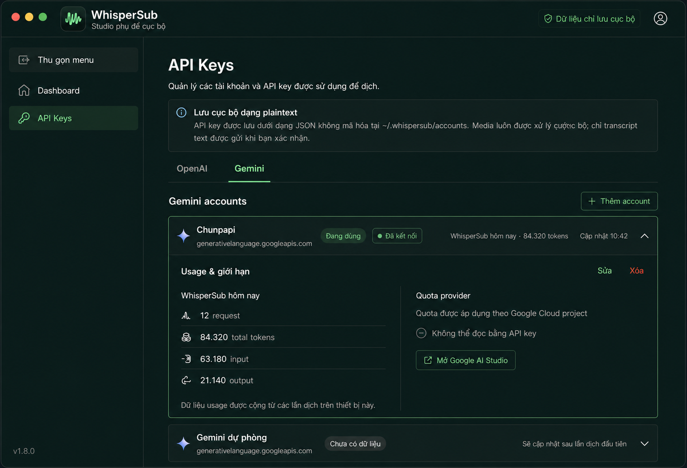
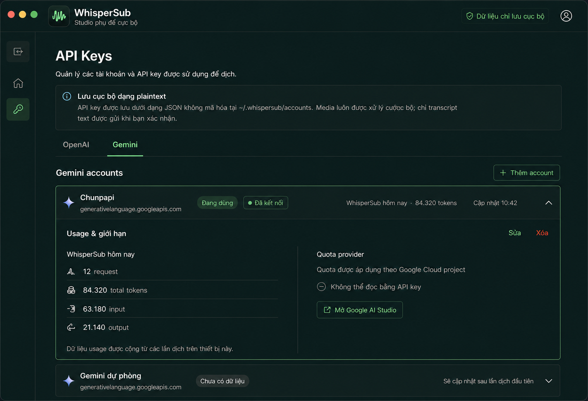

# WS-015 Sidebar App Shell Reference

## Revision v2 — brand và sidebar control

### Sidebar mở

### Sidebar thu gọn

Revision v2 thay thế mockup ban đầu cho các thay đổi app shell tiếp theo. Mockup
ban đầu vẫn được giữ tại `WS-015-sidebar-app-shell.png` để đối chiếu lịch sử.

## Mục đích

Mockup này là visual reference cho app shell có thể mở rộng của WhisperSub. Sidebar
là nơi duy nhất chuyển destination cấp ứng dụng; topbar chỉ giữ identity và trạng
thái local-processing. `OpenAI` / `Gemini` vẫn là tab cấp trang trong API key.

## Contract cho lần triển khai tiếp theo

- Brand mark duy nhất là waveform mint trong rounded-square dark; app header và
  Tauri/Dock icon phải dùng cùng silhouette này.
- Destination được gọi là `API Keys` ở navigation và page title. Copy mô tả một
  credential cụ thể vẫn dùng `API key` số ít.
- Desktop hiển thị sidebar có label và control `Thu gọn menu`. Khi thu gọn, sidebar
  trở thành icon rail khoảng 76px và control đổi accessible name thành `Mở rộng menu`.
- Trạng thái mở/thu gọn là UI preference cục bộ và nên được khôi phục ở lần mở app
  tiếp theo; không liên quan credential hoặc provider state.
- Cửa sổ hẹp tiếp tục dùng drawer mở từ topbar; không hiển thị desktop collapse
  control trong drawer.
- Chỉ destination đã hoạt động (`Dashboard`, `API Keys`) được render. Các mục trong
  mockup như history/glossary chỉ là hướng mở rộng, không tạo dead navigation.
- Waveform mark trong UI được triển khai bằng SVG code-native để giữ nét sắc ở mọi scale.
- Trạng thái active dùng accent-muted, text và icon; không phụ thuộc màu đơn lẻ.
- Provider usage/quota trong mockup là target của story sau, không thuộc WS-015.

## Khác biệt có chủ đích so với mockup

- Không thêm avatar, help, theme switcher hoặc destination chưa có behavior.
- Giữ cảnh báo plaintext và wording hiện tại của account manager.
- Giữ footer runtime hiện tại cho đến khi các destination tương lai có metadata
  riêng trong sidebar.
- Icon-only rail phải có tooltip/accessibility label cho expand, Dashboard và
  API Keys; mockup tĩnh không vẽ tooltip thường trực.
